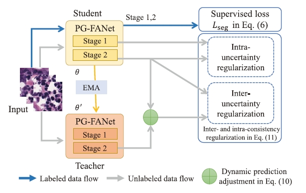
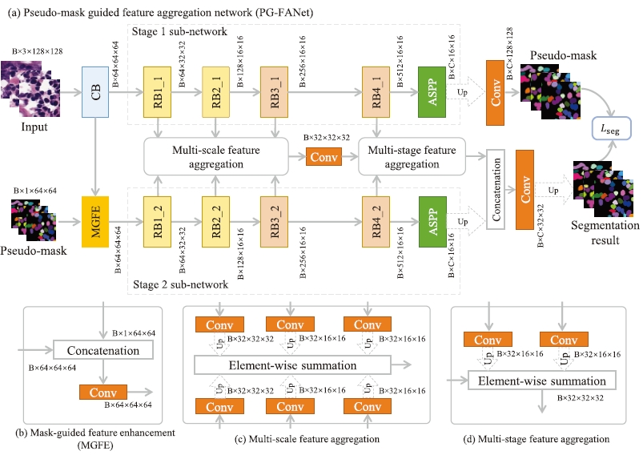
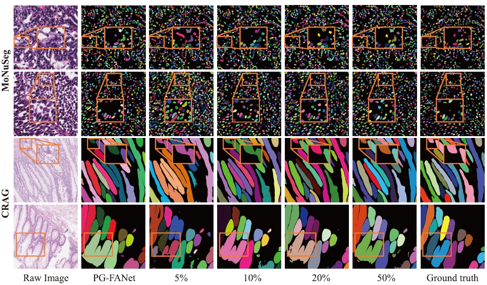

# PG-FANet

**Inter- and intra-uncertainty based feature aggregation model for semi-supervised histopathology image segmentation** (https://doi.org/10.1016/j.eswa.2023.122093) published in Expert Systems with Applications

by [Qiangguo Jin](https://scholar.google.com/citations?user=USoKG48AAAAJ), [Hui Cui](https://scholars.latrobe.edu.au/display/lcui), [Changming Sun](https://vision-cdc.csiro.au/changming.sun/), et al.

### Example results 


- Figure 1: The overall architecture of the proposed semi-supervised histopathology image segmentation model using two-stage PG-FANet and interand intra-uncertainty and consistency regularization. EMA denotes exponential moving average.
  

- Overview of our (a) PG-FANet with two-stage sub-networks, (b) mask-guided feature enhancement (MGFE) module, (c) multi-scale feature aggregation, and (d) multi-stage feature aggregation.
  

- Segmentation results on the MoNuSeg and CRAG datasets using our fully supervised PG-FANet with 100% labeled data and semisupervised learning with 5%, 10%, 20%, and 50% of the labeled data.

### Dataset
CRAG,MoNuSeg

## Citation

If the code is helpful for your research, please consider citing:

  ```shell
  @article{jin2024inter,
  title={Inter-and intra-uncertainty based feature aggregation model for semi-supervised histopathology image segmentation},
  author={Jin, Qiangguo and Cui, Hui and Sun, Changming and Song, Yang and Zheng, Jiangbin and Cao, Leilei and Wei, Leyi and Su, Ran},
  journal={Expert Systems with Applications},
  volume={238},
  pages={122093},
  year={2024},
  publisher={Elsevier}
}

@inproceedings{jin2022semi,
  title={Semi-supervised histological image segmentation via hierarchical consistency enforcement},
  author={Jin, Qiangguo and Cui, Hui and Sun, Changming and Zheng, Jiangbin and Wei, Leyi and Fang, Zhenyu and Meng, Zhaopeng and Su, Ran},
  booktitle={International Conference on Medical Image Computing and Computer-Assisted Intervention},
  pages={3--13},
  year={2022},
  organization={Springer}
}


  ```

## Social media

<p align="center"></p> 
Welcome to follow our [Wechat official account: iBioMedInfo] and [Xiaohongshu official account: iBioMedInfo], we will share recent studies on biomedical image and bioinformation analysis there.

### Global Collaboration & Questions

**Global Collaboration:** We're on a mission to biomedical research, aiming for artificial intelligence and its applications to biomedical image and bioinformation analysis, promoting the development of the medical community. Collaborate with us to increase competitiveness.

**Questions:** General questions, please contact 'qgking@tju.edu.cn'


